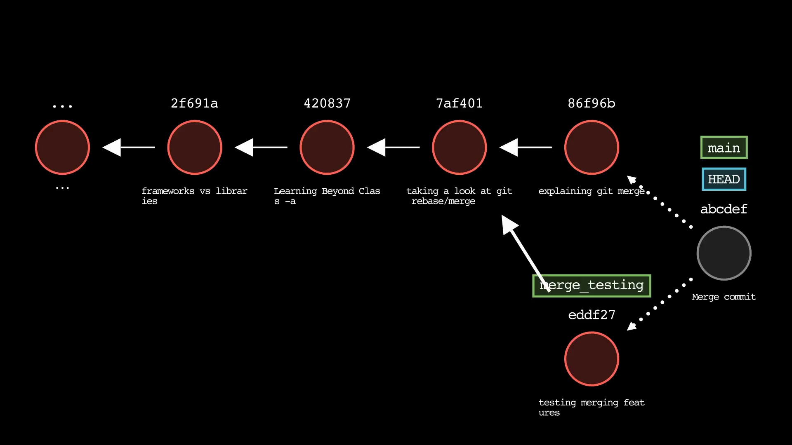

# Learning Beyond Class

## [How Can I Remove a commit on GitHub?](https://stackoverflow.com/questions/448919/how-can-i-remove-a-commit-on-github)

Scenario:
A classmate of mine had made some changes to a repo they worked on.
They made two commits, on their local branch and pushed it to their remote branch.
They then realized that they had made a mistake and wanted to remove the commit from both their local and remote branch.

Solution:

```js
git reset --hard HEAD~1
```

Let's break down what the `git` command above is doing:

- `reset` - resets the current branch to a specific commit
- `--hard` - resets the index and working tree. Any changes to tracked files in the working tree since <commit> are discarded.
- `HEAD~1` - the commit to reset to. `HEAD` is a pointer to the current branch (ie the most recent commit), and `~1` is the previous commit.

This command will remove the last commit from the current branch, and reset the index and working tree to that state. Since the commit that needed to be removed was already pushed to the remote branch, we need to force push the changes we have just made to the remote branch.

```js
git push -f origin main
```

Let's also break down the git command above:

- `push` - push changes to remote branch
- `-f` - force push. This is required because we have removed a commit from the remote branch.
- `origin` - the remote repository
- `main` - the remote branch

These commands will remove the last commit from the current branch, and reset the index and working tree to that state. Since the commit that needed to be removed was already pushed to the remote branch, we need to force push the changes we have just made to the remote branch.

## [Git Rebase](https://www.atlassian.com/git/tutorials/rewriting-history/git-rebase)

While looking up the solution for the problem above I encountered the term `git rebase`. I had never heard of it before, so I decided to look it up and research what it does.

The `git rebase` is one out of two git utilities/commands that are used for integrating/changing the history of a git repository or merging changes from one branch to another branch, If what I understood is to be believed.

I think before even understanding this concept of `git rebase`, I believe it is important to understand the concept of `git merge` first.

The documentation for `git merge` is [here](https://git-scm.com/docs/git-merge).

This command allows us to combine or `merge` changes from different branches. When we merge two branches, `git` creates a new commit that includes changes from both branches.

I think a good example to understand what `git merge` does is to look at the following diagram:

<br/>

# `git merge merge_testing`



<br/>

The diagram above depicts the command `git merge merge_testing` being run on the `main` branch. The `main` branch is the current branch, and the `merge_testing` branch is the branch that we want to merge into the `main` branch.

<br/>

Git will then compare the changes in the two branches and try to merge them together. If there are no conflicts, then `git` will create a new commit that includes the changes from both branches. But if there are conflicts between the two branches, then `git` will not be able to merge the two branches together. Instead it will stop the merge process and ask us to resolve the conflicts manually.

<br/>

I'm using vsCode as my code editor, and it has a built in git tool that allows us to see the changes between the two branches. The tool is called `Source Control` and it is located on the left side of the screen. When a merge conflict occurs, the tool will show us the conflicts in the file at which point we can then resolve the conflicts manually.

[Here](https://stackoverflow.com/questions/38216541/visual-studio-code-how-to-resolve-merge-conflicts-with-git) is a link to a stackoverflow post that explains how to resolve merge conflicts in VSCode.

<br/>

Let's use graphical examples:

This shows the 'main' branch before the merging with the 'merge_testing' branch:

```js
       A --- B --- C         (main)
            \
             D --- E --- F  (merge_testing)
```

This shows the 'main' branch after the merging with the 'merge_testing' branch:

```js
       A --- B --- C --------- G  (main)
            \                 /
             D --- E --- F    (merge_testing)
```

<br/>

The commit `G` is the commit that was created when we merged the `merge_testing` branch into the `main` branch.

<br/>

At this point the question becomes what is the difference between `git merge` and `git rebase`?

## `Merging` vs `Rebasing` in Git - [Atlassian](https://www.atlassian.com/git/tutorials/merging-vs-rebasing)

As explained above the git command:

- The `git merge` is used to merge changes from one branch to another branch.
- The `git rebase` command is used to integrate changes from one branch to another branch.

`git merge` and `git rebase` are two different ways of integrating changes from one branch to another branch. While `git merge` creates a new commit, `git rebase` re-writes the project history by creating brand new commits for each commit in the original branch. Git re-writes the commit history to make it look like the changes were always made directly to the target branch. This means that instead a merge commit being created for us, we will have a linear commit history.
